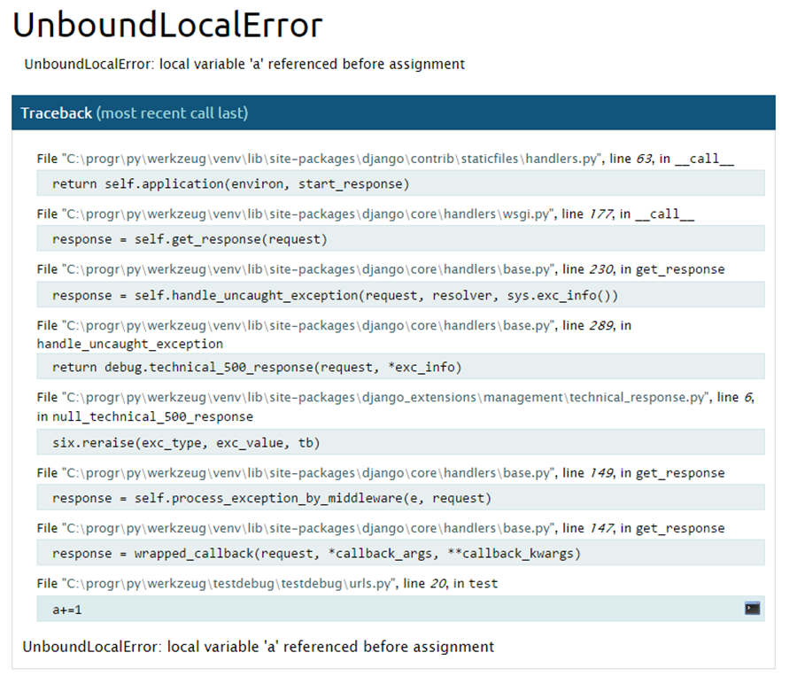
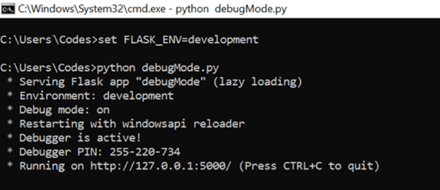
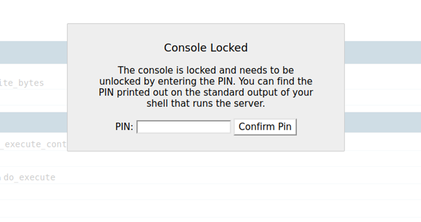

 <h1 align="center">Tổng quan về Werkzeug Debugger</h1>


#### **Werkzeug là thư viện tiện ích WSGI dành cho Python. Ngoài những tính năng cơ bản, nó còn bao gồm một interactive debugger - điều này có nghĩa là khi ứng dụng python xuất hiện exception, Werkzeug sẽ hiển thị stacktrace ngay trên trình duyệt và cho phép người dùng viết các lệnh python ngay trên nó**

### <u>**Web application với Python**</u>

1. WSGI

​		WSGI (Web Server Gateway Interface) là tiêu chuẩn để kết nối các ứng dụng web  Python với các 		máy chủ web, được sử dụng trong phát triển Python web app.

2. Werkzeug

​		Werkzeug là  một thư viện WSGI utility, thực hiện các yêu cầu, đối tượng phản hồi và các chức năng 		tiện ích. Werkzeug có thể được sử dụng trong các web framework với  Python.

3. Web Framework

   Một trong những framework phổ biến với Python là Django. Tuy nhiên Django không hoàn toàn phụ thuộc vào Werkzeug.

   Một framework phổ biến khác là Flask. Khác với Django, Werkzeug là một phần không thế thiếu trong kiến trúc của Flask.


### <u>**Điểm mạnh của Werkzeug**</u>

Là một thư viện công cụ WSGI, Werkzeug ngoài việc hỗ trợ thực hiện các chức năng cơ bản để chạy một web application dựa trên WSGI, thì Werkzeug còn được tích hợp một debugger, cho phép người dùng xem stackstace và thực thi lệnh Python ngay trên trình duyệt web trong trường hợp xuất hiện exception. Để truy cập vào debugger, developer có thể truy cập vào endpoint /console, hoặc từ màn hình lỗi click vào icon terminal nhỏ kế bên stacktrace.




​		 										*Hình 1: Debugger của Werkzeug* 


Để kích hoạt được debugger này thì người dùng cần launch server ở Debug mode. Tuy nhiên với việc cho phép thực thi câu lệnh Python từ xa có khả năng bị khai thác như một RCE, Werkzeug debugger console được bảo vệ bởi một mã PIN dưới dạng XXX-XXX-XXX với X là một chữ số 0-9. Khi launch server, mã PIN cho console được hiển thị ngay trên terminal để bảo đảm chỉ có developer mới có quyền truy cập vào console.




​													*Hình 2: Mã PIN được hiển thị trên terminal*


Nếu như Debug Mode được bật, và debugger được bảo vệ bởi mã PIN thì khi một người dùng truy cập vào debugger sẽ bị yêu cầu PIN như hình:



​														Hình 3: Yêu cầu PIN để truy cập vào debugger

Theo như [repo github werkzeug](https://github.com/pallets/werkzeug/blob/main/src/werkzeug/debug/__init__.py) mã PIN này không được tạo ra ngẫu nhiên, mà được tạo ra từ các thông số của máy. Sau đây là các biến cần để tạo PIN, được phân làm 2 trường **probably_public_bits** và **private_bits**

```Python
probably_public_bits = [
    username,
    modname,
    getattr(app, '__name__', getattr(app.__class__, '__name__')),
    getattr(mod, '__file__', None),
]

private_bits = [
    str(uuid.getnode()),
    get_machine_id(),
]
```

**probably_public_bits**:

* username của user launch app
* modname là module name, trong trường hợp webapp sử dụng Flask thì mặc định là flask.app
*  application name

* Đường dẫn tới file app.py

**private_bits**:

* MAC address của network interface host webapp, được chuyển đổi sang thập phân 
* machine-id là giá trị của /etc/machine-id kết hợp với giá trị cuối cùng của /proc/self/cgroup, ngăn cách bởi dấu / (ví dụ nếu cgroup có giá trị là **0::/system.slice/flaskapp.service** thì chỉ lấy **flaskapp.service** )

Sau khi thu thập đủ tất cả các biến, ghép toàn bộ những thông tin trên thành 1 string sau đó áp dụng MD5 (phiên bản mới hơn sử dụng SHA1) cho string thu được và encode kết quả dưới dạng thập phân và thêm dấu gạch - vào giữa mỗi 3 chữ số là đã thu đươc mã PIN có dạng XXX-XXX-XXX. 


Vậy giả sử nếu như trong webapp tồn tại một lỗ hổng cho phép thu thập các thông tin trên, thì hacker hoàn toàn có thể tái tạo lại mã PIN và thành công khai thác RCE trên server.
